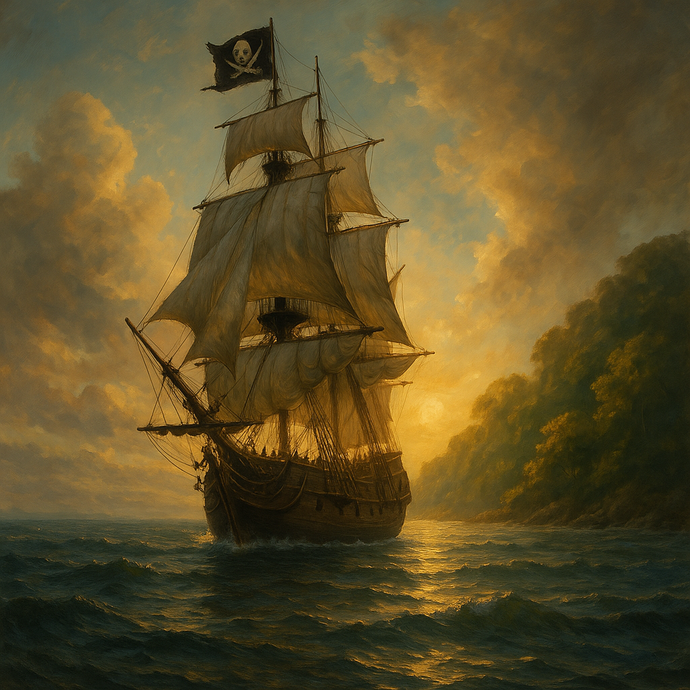
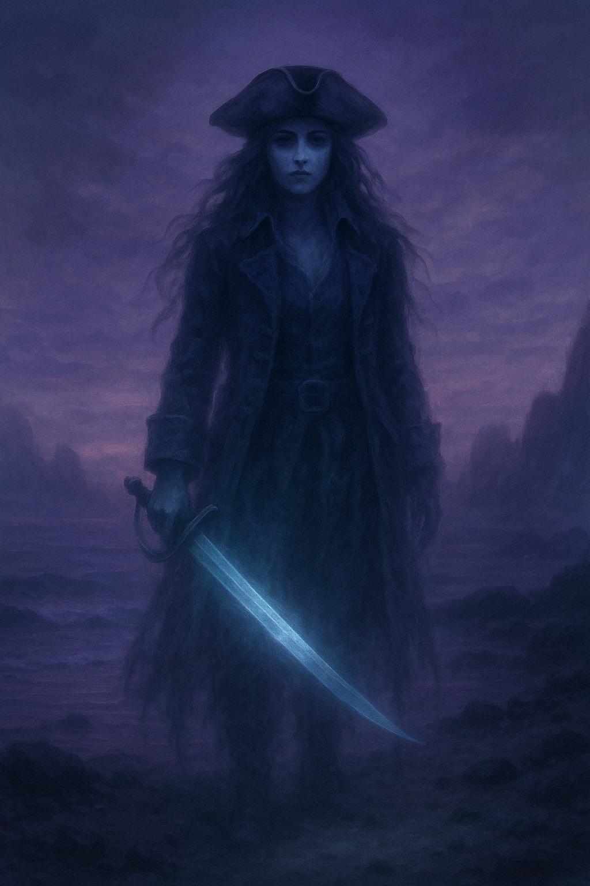
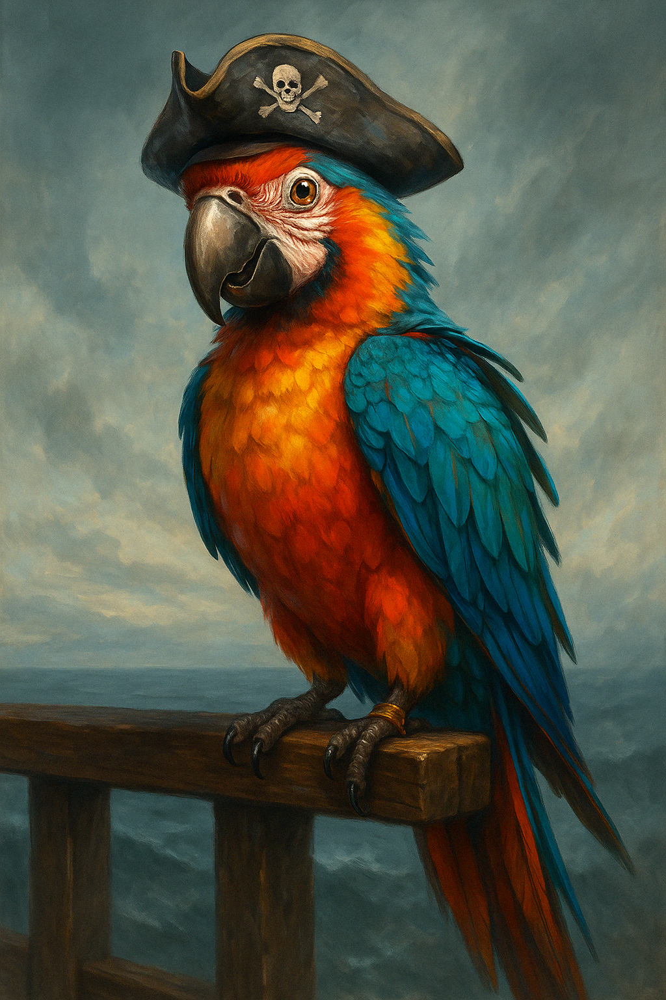
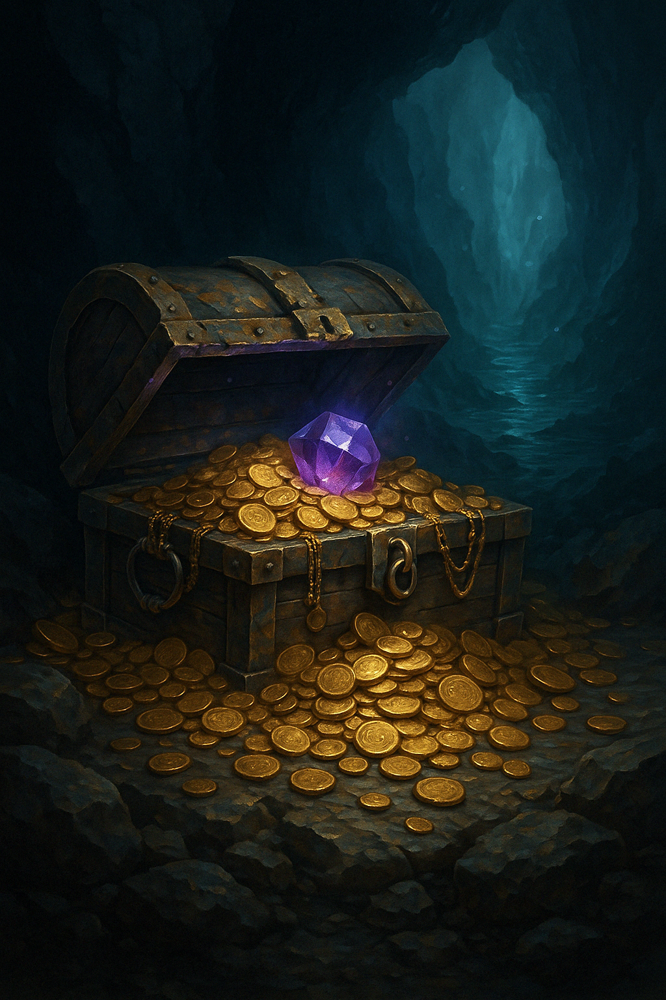
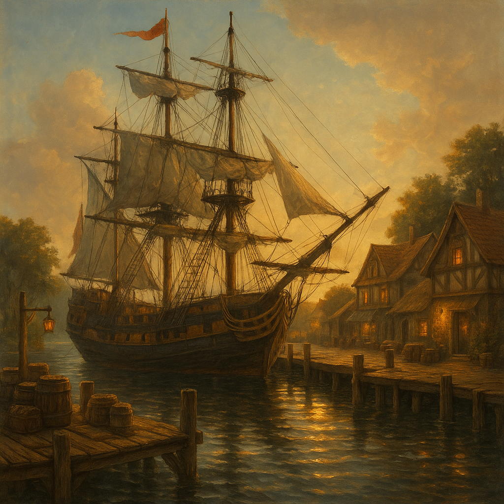

# Pirate Adventure – Full GUI Edition

A Python-based interactive adventure game built with tkinter, featuring dynamic gameplay, hidden encounters, and progression systems.

## Project Overview
This project demonstrates building a fully interactive desktop application using Python, including state management, UI design, and packaging for distribution.

## Features
- GUI development using tkinter
- Randomized events and branching logic
- Progress tracking with collectibles and badges
- Hidden encounters (Anne Bonny & secret island)
- Packaged into a standalone executable (.exe)

## How to Run

**Option 1: Run the Python Script**
- Requires Python and necessary libraries installed
- Run `pirate_adventure.py`

**Option 2: Download the Executable (Optional)**
- Download Pirate Adventure (.exe)
- https://drive.google.com/file/d/1Fw8jzzH2jYL4s1dD3TzYDbxg7NRqPnKS/view?usp=drive_link
- No installation required
- Some browsers may display a warning for executable files

## Notes
Some systems may display a warning when downloading the executable, as it is a locally built Python application.

## Game Images

### Main Game Interface

### Anne Bonny Encounter

### Squawkles Commentary

### Secret Island Discovery

### End Voyage

